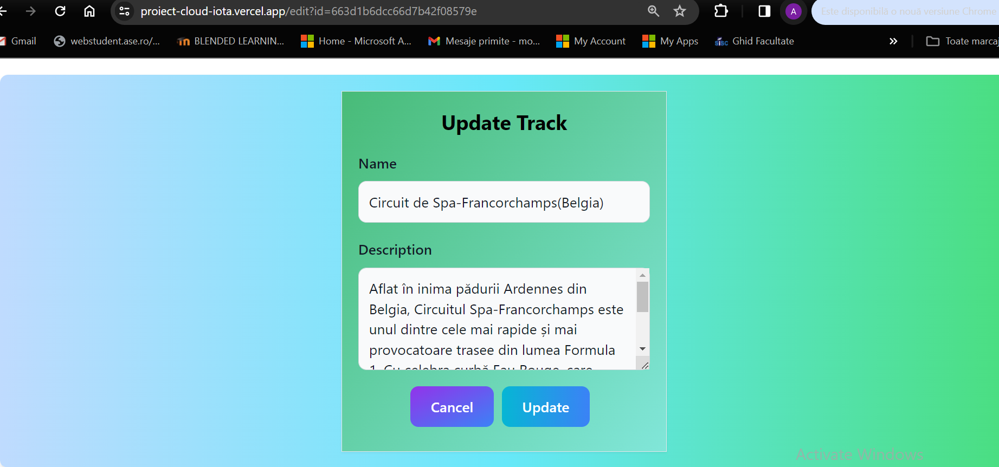
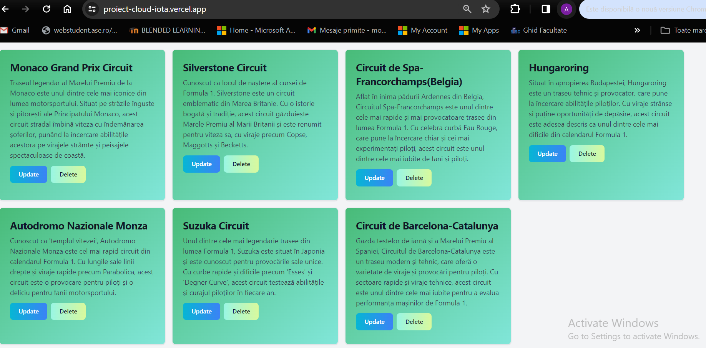

Introducere
Cloud computing-ul a devenit o parte esențială a lumii IT moderne, oferind o modalitate rentabilă și scalabilă pentru organizații de a-și accesa nevoile IT. De la startupuri mici la întreprinderi mari, organizațiile de toate tipurile, dimensiunile și industriile utilizează cloud computing-ul pentru o gamă largă de cazuri de utilizare.
Cine folosește cloud computing?
Răspunsul simplu este: toată lumea. Cloud computing-ul este utilizat de o gamă largă de organizații, indiferent de tip, dimensiune sau industrie. Câteva exemple:
1. Organizații din domeniul sănătății: Utilizează cloud computing-ul pentru a dezvolta tratamente mai personalizate pentru pacienți, a stoca și gestiona date medicale sensibile și a colabora cu alți profesioniști din domeniul sănătății.
2.Companii de servicii financiare: Utilizează cloud computing-ul pentru a alimenta detectarea și prevenirea fraudei în timp real, a oferi servicii financiare personalizate clienților și a respecta reglementările stricte din domeniul financiar.
3.Producători de jocuri video: Utilizează cloud computing-ul pentru a oferi jocuri online milioanelor de jucători din întreaga lume, a scala infrastructura pentru a face față cererii mari și a crea experiențe de joc mai captivante.
4.Organizații guvernamentale: Utilizează cloud computing-ul pentru a oferi servicii cetățenilor, a îmbunătăți eficiența operațiunilor și a reduce costurile.
5.Organizații non-profit: Utilizează cloud computing-ul pentru a colabora cu echipe distribuite, a strânge fonduri și a ajunge la un public mai larg.
6.Companii mici și mijlocii: Utilizează cloud computing-ul pentru a nivela terenul de joc cu concurenții mai mari, a accesa cele mai noi tehnologii și a reduce costurile IT.

Beneficiile cloud computing

Există multe beneficii ale utilizării cloud computing-ului, printre care:
•	Agilitate: Cloud computing-ul oferă organizațiilor acces rapid la o gamă largă de resurse IT, permițându-le să inoveze mai rapid și să lanseze noi produse și servicii mai rapid.
•	Elasticitate: Cloud computing-ul permite organizațiilor să scaleze resursele IT în sus sau în jos în funcție de nevoi, evitând costurile de supraprovizionare a infrastructurii.
•	Reducerea costurilor: Cloud computing-ul poate ajuta organizațiile să economisească bani prin transformarea costurilor de capital în costuri operaționale variabile.
•	Implementare globală rapidă: Cloud computing-ul permite organizațiilor să implementeze rapid noi aplicații și servicii în locații geografice multiple.
•	Fiabilitate: Cloud computing-ul oferă un nivel ridicat de fiabilitate și disponibilitate, asigurându-vă că aplicațiile și datele dvs. sunt întotdeauna accesibile.
Tipuri de cloud computing
Există trei tipuri principale de cloud computing:
1.Infrastructură ca serviciu (IaaS): IaaS oferă organizațiilor componente IT de bază, cum ar fi servere, stocare și rețea, ca serviciu.
2.Platformă ca serviciu (PaaS): PaaS oferă organizațiilor o platformă pentru a dezvolta, implementa și gestiona aplicații.
3.Software ca serviciu (SaaS): SaaS oferă organizațiilor aplicații software pre-construite care sunt accesibile prin internet.

2. Descrierea problemei
Proiectul se concentrează pe prezentarea numelor și descrierilor circuitelor de Formula 1. 
Acesta va include o interfață ușor de utilizat pentru a introduce, vizualiza și modifica numele și descrierile circuitelor F1. Informațiile vor fi stocate într-o bază de date MongoDB, permițând efectuarea operațiunilor CRUD (Create, Read, Update, Delete) pentru a gestiona eficient datele.
Prezentarea tehnologiile utilizate
1.MongoDB este o bază de date NoSQL care utilizează documente JSON flexibile pentru a stoca date. Este o alegere excelentă pentru acest proiect datorită scalabilității sale, ușurinței de utilizare și capacității de a stoca date structurate și nestructurate.
MongoDB stochează date în colecții, care sunt similare cu tabelele din bazele de date relaționale. Fiecare document din colecție este un obiect JSON care poate conține o varietate de câmpuri și valori. MongoDB oferă o interfață de interogare puternică care permite utilizatorilor să caute, să sorteze și să filtreze date cu ușurință.
Operațiuni CRUD
•	Create (Creare): Adaugă un nou document în colecția de circuite F1.
•	Read (Citire): Recuperează documente din colecția de circuite F1.
•	Update (Actualizare): Modifică datele existente în documentele din colecția de circuite F1.
•	Delete (Ștergere): Elimină documente din colecția de circuite F1.
Beneficiile utilizării MongoDB
•	Scalabilitate: MongoDB poate scala orizontal pentru a gestiona cantități mari de date.
•	Ușurință de utilizare: MongoDB are o interfață de interogare intuitivă și ușor de învățat.
•	Stocare flexibilă: MongoDB poate stoca date structurate și nestructurate.
•	Performanță: MongoDB oferă o performanță ridicată pentru operațiunile de citire și scriere.

2. Next.js
Next.js este un framework JavaScript open-source pentru construirea de aplicații web front-end performante și scalabile. Este construit pe React și oferă o serie de caracteristici care simplifică dezvoltarea de aplicații web moderne.
Caracteristici cheie ale Next.js:
•	Redare dinamică a laturii serverului (SSR): Next.js permite redarea dinamică a componentelor React pe server, oferind performanță îmbunătățită și SEO mai bun.
•	Generare statică a site-ului (SSG): Next.js poate genera site-uri web statice la timp de compilare, reducând timpul de încărcare a paginii și îmbunătățind experiența utilizatorului.
•	Rutare automată: Next.js oferă o configurare automată a rutare pentru paginile aplicației, făcând-o mai ușor de configurat și de gestionat.
•	Suport pentru API-uri: Next.js permite crearea de API-uri RESTful și GraphQL direct în cadrul aplicației.
•	Componente integrate: Next.js vine cu o serie de componente integrate, cum ar fi Link, Head și Image, care simplifică dezvoltarea comună a sarcinilor.
Beneficiile utilizării Next.js:
•	Performanță: Next.js oferă o performanță excelentă prin redarea dinamică a laturii serverului și generarea statică a site-ului.
•	SEO: Next.js este optimizat pentru SEO, făcând site-urile web mai ușor de găsit de motoarele de căutare.
•	Experiență dezvoltator: Next.js oferă o experiență de dezvoltare plăcută, cu o configurare simplă și o gamă largă de caracteristici.
•	Scalabilitate: Next.js este scalabil și poate fi utilizat pentru a construi aplicații web complexe cu trafic ridicat.
Exemplu de utilizare a Next.js:
Next.js poate fi utilizat pentru a construi o varietate de aplicații web, cum ar fi:
•	Site-uri web de afaceri
•	Magazine online
•	Bloguri
•	Aplicații web cu o singură pagină (SPA)
•	Tablouri de bord
•	Platforme de streaming media

3. Vercel este o platformă de deployment (publicare) care ajută dezvoltatorii să lanseze și să scaleze aplicații web moderne cu ușurință. Oferă o suită de instrumente integrate pentru a simplifica fluxul de lucru al dezvoltatorilor, de la codul sursă la aplicația live.
Caracteristici cheie ale Vercel:
•	Deploy rapid: Vercel oferă deployment automat din codul sursă versionat, cum ar fi Git. Aplicațiile sunt publicate rapid și actualizate instantaneu la fiecare push către depozitul Git.
•	Serverless Functions: Vercel acceptă funcții serverless, permițând dezvoltatorilor să scrie cod care rulează pe server, dar fără a gestiona infrastructura.
•	Routing fără configurație: Vercel detectează automat rutele din aplicația dvs. și le configurează fără a fi necesară o configurare manuală complexă.
•	Certificat SSL gratuit: Toate aplicațiile publicate pe Vercel primesc automat un certificat SSL gratuit, asigurând conexiuni HTTPS securizate.
•	Integrare globală CDN: Vercel folosește un CDN (Content Delivery Network) global pentru a livra conținutul aplicației dvs. utilizatorilor din întreaga lume cu o latență minimă.
•	Preview instant: Vercel permite preview instant al modificărilor din codul sursă înainte de publicare, oferind feedback rapid.
•	Colaborare în echipă: Vercel permite colaborarea în echipă pe proiecte, cu control al versiunilor și gestionarea permisiunilor.
•	Analize integrate: Vercel oferă analize integrate pentru a monitoriza performanța aplicației dvs. și a înțelege cum interacționează utilizatorii cu ea.
Beneficiile utilizării Vercel:
•	Viteză și performanță: Vercel ajută la livrarea rapidă și fiabilă a aplicațiilor web moderne.
•	Ușurință de utilizare: Platforma este ușor de utilizat, permițând dezvoltatorilor să se concentreze pe codul lor.
•	Scalabilitate: Vercel se poate scala automat pentru a gestiona traficul crescut.
•	Colaborare îmbunătățită: Vercel facilitează colaborarea eficientă în echipă.
•	Costuri reduse: Vercel oferă un plan gratuit generos și tarife avantajoase pentru proiecte cu nevoi mai mari.
Vercel și Next.js:
Vercel are o relație strânsă cu framework-ul web Next.js. De fapt, Vercel a fost fondat de aceeași echipă care a creat Next.js. Vercel oferă deployment optimizat pentru Next.js, oferind performanțe îmbunătățite și o experiență de dezvoltare simplificată.
3. Prezentarea aplicatiei 
Aplicația care prezinta circuitele de Formula 1 este destinată pasionaților de acest sport și oferă o experiență captivantă:
•	Explorează circuitele din întreaga lume, descoperind detalii precum nume, descrieri și locații.
•	Beneficiază de funcționalități complete de gestionare a datelor, inclusiv crearea, citirea, actualizarea și ștergerea informațiilor despre circuite.
•	Prezenta unui design modern, intuitiv și ușor de utilizat, care oferă o navigare plăcută și eficientă în cadrul aplicației.
4. Flux de date 
	Aplicația utilizează un flux de date RESTful (Representational State Transfer) pentru a gestiona informațiile despre circuite. Iată două exemple:
1. GET /api/tracks
•	Methodă: GET
•	Request: Clientul trimite o solicitare pentru a obține toate circuitele din baza de date. Nu este nevoie de corp pentru request (body).
•	Response: Serverul răspunde cu un cod de stare 200 (OK) și un array JSON conținând obiecte individuale pentru fiecare circuit. Fiecare obiect poate include proprietăți precum nume, locație, lungime etc.
2. POST /api/tracks
•	Methodă: POST
•	Request: Clientul trimite o solicitare pentru a crea un circuit nou. Corpul request-ului (body) conține un obiect JSON cu detaliile circuitului nou.
•	Response: Serverul validează datele primite. Dacă datele sunt corecte, serverul creează circuitul nou în baza de date și returnează un cod de stare 201 (Created) împreună cu obiectul circuit nou creat (în format JSON). În caz de eroare (e.g., date invalide), serverul returnează un cod de stare de eroare (e.g., 400 Bad Request) și un mesaj descriptiv.
Concluzie
Aplicația "Circuite F1" pe care am prezentat-o oferă o modalitate eficientă și convenabilă pentru fanii Formula 1 de a descoperi, explora și gestiona informații despre circuitele legendare ale acestui sport. Funcționalitățile CRUD (Creare, Citire, Actualizare, Ștergere) permit utilizatorilor să interacționeze activ cu datele, personalizându-și experiența.
Tehnologia modernă utilizată asigură o performanță rapidă, o scalabilitate ridicată și o experiență de utilizator intuitivă. Aplicația "Circuite F1" reprezintă o resursă valoroasă pentru fanii F1, jurnaliști, experți și pasionați de motorsport, oferindu-le un instrument interactiv pentru a se conecta cu lumea fascinantă a Formulei 1.

Referinte:
Link github : https://github.com/adrianam003/Proiect_Cloud
Link aplicatie : https://proiect-cloud-iota.vercel.app/ 
Link prezentare : https://youtu.be/fBytPa-fil8 
